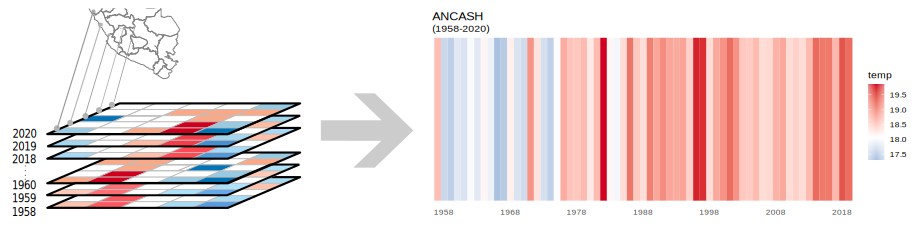

```{r setup, include=FALSE}
## Global options
knitr::opts_chunk$set(cache = TRUE)
```

### 1. Metodología

> Los valores de temperatura máxima estimado para cada uno de los 24 departamentos del Perú desde el año de 1980 al 2022, fueron calculados mediante estadisticas areales, donde el promedio anual de todos pixeles entrantantes en las respectivas regiones durante los ultimos 42 años fueron consideradas para su estimación, para posteriormente ser gráficados mediante los **Stripes** o **rayas de Ed Hawkins**.
Las Stripes son representaciones visuales donde se evalua la evolución de las  temperaturas medias para cada una de las regiones de interés  durante al menos los últimos 100 años.



### 2. Datos 

Los valores de temperatura máxima obtenidas durante  los últimos 42 años, fueron adquiridas del conjunto de datos de TerraClimate, un conjunto de datos de clima mensual y balance hídrico climático para superficies terrestres globales, más información [*clic aquí*](https://developers.google.com/earth-engine/datasets/catalog/IDAHO_EPSCOR_TERRACLIMATE#description). 

### 3. Resultados {.tabset}

#### AMAZONAS

```{r ,echo=FALSE,warning=FALSE,message=FALSE}

```


#### ANCASH

```{r ,echo=FALSE,warning=FALSE,message=FALSE}

```

#### APURIMAC

```{r ,echo=FALSE,warning=FALSE,message=FALSE}

```

#### AREQUIPA

```{r ,echo=FALSE,warning=FALSE,message=FALSE}

```

#### AYACUCHO

```{r ,echo=FALSE,warning=FALSE,message=FALSE}

```

#### CAJAMARCA

```{r ,echo=FALSE,warning=FALSE,message=FALSE}

```

#### CUSCO

```{r ,echo=FALSE,warning=FALSE,message=FALSE}

```

#### HUANCAVELICA

```{r ,echo=FALSE,warning=FALSE,message=FALSE}

```

#### HUANUCO

```{r ,echo=FALSE,warning=FALSE,message=FALSE}

```

#### ICA

```{r ,echo=FALSE,warning=FALSE,message=FALSE}

```

#### JUNIN

```{r ,echo=FALSE,warning=FALSE,message=FALSE}

```

#### LA LIBERTAD

```{r ,echo=FALSE,warning=FALSE,message=FALSE}

```


#### LAMBAYEQUE

```{r ,echo=FALSE,warning=FALSE,message=FALSE}

```


#### LIMA

```{r ,echo=FALSE,warning=FALSE,message=FALSE}

```

#### LORETO

```{r ,echo=FALSE,warning=FALSE,message=FALSE}

```

#### MADRE DE DIOS

```{r ,echo=FALSE,warning=FALSE,message=FALSE}

```

#### MOQUEGUA

```{r ,echo=FALSE,warning=FALSE,message=FALSE}

```

#### PASCO

```{r ,echo=FALSE,warning=FALSE,message=FALSE}

```

#### PIURA

```{r ,echo=FALSE,warning=FALSE,message=FALSE}

```

#### PUNO

```{r ,echo=FALSE,warning=FALSE,message=FALSE}

```


#### SAN MARTIN

```{r ,echo=FALSE,warning=FALSE,message=FALSE}

```

#### TACNA

```{r ,echo=FALSE,warning=FALSE,message=FALSE}

```

#### TUMBES

```{r ,echo=FALSE,warning=FALSE,message=FALSE}

```

#### UCAYALI

```{r ,echo=FALSE,warning=FALSE,message=FALSE}

```


